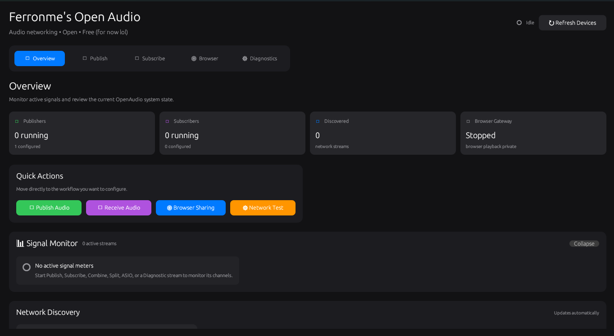
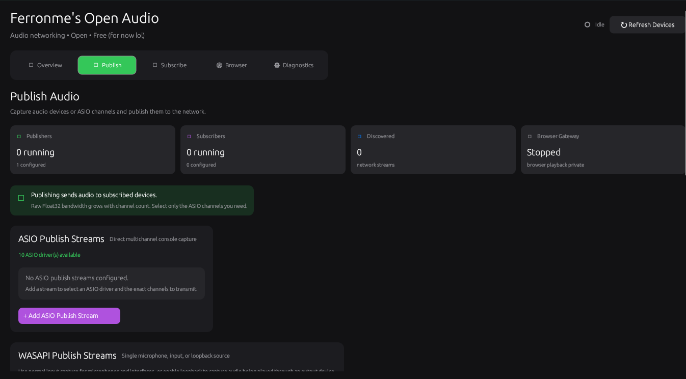
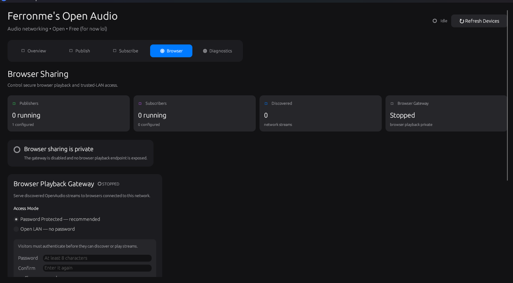

# Ferronme's Open Audio

**Low-latency, multichannel audio streaming across a local network.**

Ferronme's Open Audio is an experimental Windows desktop application for publishing, discovering, receiving, routing, monitoring, and recording audio streams over a LAN. It supports standard Windows audio devices through WASAPI, professional multichannel workflows through ASIO, and optional browser-based playback.

> **Project status:** Active development. Test thoroughly before using it in live production, broadcast, or safety-critical environments.

## Value Proposition

**For audio engineers, musicians, creators, and technical teams who need flexible audio routing between computers, Ferronme's Open Audio delivers configurable multichannel LAN streaming without requiring proprietary audio-networking hardware, unlike closed commercial routing ecosystems.**

## Features

### Audio publishing

- Publish microphones and audio-interface inputs using WASAPI
- Capture Windows output through WASAPI loopback
- Capture selected channels directly from ASIO drivers
- Combine several Windows devices into one multichannel stream
- Select only the ASIO channels that should be transmitted
- Advertise active streams for automatic LAN discovery
- Record published audio to WAV

### Audio receiving and routing

- Automatically discover available streams
- Play a received stream through a standard Windows output
- Control playback volume
- Split incoming channels across separate output devices
- Route channels directly to ASIO outputs
- Create and use SAR virtual playback endpoints
- Record received audio to WAV

### Browser playback

- Start or stop browser sharing explicitly
- Password-protected and open-LAN access modes
- Browser player and API on port `7100`
- WebSocket audio relay on port `7101`
- Configurable client and session limits

### Monitoring and diagnostics

- Application overview and session summaries
- Stream and signal monitoring
- Synthetic network diagnostics
- Publisher and subscriber status reporting
- Human-readable device and transport errors
- Estimated raw bandwidth for multichannel streams

## Screenshots


## Screenshots

### Overview



### ASIO Publishing



### Browser Sharing




## Requirements

### Core requirements

- Windows 10 or Windows 11
- Rust stable toolchain
- Cargo
- A working Windows audio input or output
- A wired or reliable local network

Install Rust with [rustup](https://rustup.rs/).

### Optional ASIO requirements

ASIO support requires:

- An installed ASIO driver for your audio interface or console
- The Steinberg ASIO SDK
- `CPAL_ASIO_DIR` configured to point to the SDK
- Building the application with the `asio` feature

Example in PowerShell:

```powershell
$env:CPAL_ASIO_DIR = "C:\SDKs\ASIOSDK"
cargo run --manifest-path ".\apps\sender\Cargo.toml" --features asio
```

To save the variable for future terminals:

```powershell
[Environment]::SetEnvironmentVariable(
    "CPAL_ASIO_DIR",
    "C:\SDKs\ASIOSDK",
    "User"
)
```

Restart the terminal after setting a persistent environment variable.

### Optional SAR requirements

Split and combined virtual-device workflows may require SAR:

- Install and configure SAR
- Open SAR through its own interface at least once
- Confirm that SAR's `default.json` configuration exists
- Restart the relevant DAW or ASIO connection after creating endpoints
- Refresh devices inside OpenAudio

## Getting Started

### 1. Clone the repository

```powershell
git clone https://github.com/web123r/OpenAudio.git
cd ./OpenAudio
```


### 2. Format and check the workspace

Without ASIO:

```powershell
cargo fmt
cargo check --workspace --all-targets
```

With ASIO:

```powershell
cargo fmt
cargo check --workspace --all-targets --features asio
```

### 3. Run the desktop application

Without ASIO:

```powershell
cargo run --manifest-path ".\apps\sender\Cargo.toml"
```

With ASIO:

```powershell
cargo run --manifest-path ".\apps\sender\Cargo.toml" --features asio
```

### 4. Create a release build

Without ASIO:

```powershell
cargo build --release --manifest-path ".\apps\sender\Cargo.toml"
```

With ASIO:

```powershell
cargo build --release --manifest-path ".\apps\sender\Cargo.toml" --features asio
```

The executable will normally be created under:

```text
target/release/
```

## Basic Workflows

### Publish a microphone or interface input

1. Open **Publish**.
2. Add a WASAPI publish stream.
3. Choose an input device.
4. Enter a node name and stream name.
5. Enable WAV recording if needed.
6. Start publishing.

### Publish Windows playback audio

1. Open **Publish**.
2. Add a WASAPI publish stream.
3. Enable **Loopback capture**.
4. Choose the output device being used by Windows.
5. Start publishing.

### Publish selected ASIO channels

1. Build and run the application with `--features asio`.
2. Open **Publish**.
3. Add an ASIO publish stream.
4. Select the required ASIO driver.
5. Select only the channels you need.
6. Enter the node, stream name, and stream ID.
7. Start the stream.

Selecting fewer channels reduces network traffic and receiver processing.

### Receive a stream through Windows audio

1. Start a publisher on the same LAN.
2. Open **Subscribe**.
3. Add a WASAPI playback session.
4. Select a discovered stream.
5. Choose an output device and an unused local UDP port.
6. Start playback.

### Split incoming channels

1. Open **Subscribe**.
2. Add a split playback session.
3. Select a discovered multichannel stream.
4. Assign an output device to each channel.
5. Optionally create SAR playback endpoints.
6. Start split playback.

### Share audio with browsers

1. Open **Browser Sharing**.
2. Choose password-protected or open-LAN access.
3. Start the browser gateway.
4. Find the host computer's LAN IP address:

   ```powershell
   ipconfig
   ```

5. From another device on the same LAN, visit:

   ```text
   http://HOST_IP:7100/
   ```

Replace `HOST_IP` with the IPv4 address of the computer running OpenAudio.

## Bandwidth Planning

The current transport uses raw Float32 audio in relevant streaming paths. Approximate audio payload bandwidth is:

```text
bandwidth = channels × sample rate × 4 bytes × 8 bits
```

At 48 kHz:

| Channels | Approximate payload |
|---:|---:|
| 1 | 1.54 Mbps |
| 2 | 3.07 Mbps |
| 8 | 12.29 Mbps |
| 16 | 24.58 Mbps |
| 32 | 49.15 Mbps |
| 64 | 98.30 Mbps |

These figures exclude packet, network, WebSocket, and other protocol overhead.

For large streams:

- Prefer wired Gigabit Ethernet
- Select only the channels required by the receiver
- Avoid congested Wi-Fi networks
- Test two-channel and full-channel configurations separately
- Monitor underruns, packet loss, latency, and audio artifacts

## Architecture

```text
┌─────────────────────────────────────────────────────────────┐
│                   OpenAudio Desktop UI                      │
│      Overview · Publish · Subscribe · Browser · Tests       │
└────────────────────────────┬────────────────────────────────┘
                             │
┌────────────────────────────▼────────────────────────────────┐
│                        audio_core                           │
│ Capture · Playback · Discovery · Control · Routing · WAV   │
└───────────────┬───────────────────────┬─────────────────────┘
                │                       │
        ┌───────▼────────┐      ┌───────▼────────┐
        │ WASAPI / ASIO  │      │ LAN Transport  │
        │ Audio Devices  │      │ + Discovery    │
        └────────────────┘      └───────┬────────┘
                                       │
                                ┌──────▼───────┐
                                │ Subscribers │
                                │ and Browsers│
                                └──────────────┘
```

The desktop interface owns configuration and session lifecycle state. Audio capture, playback, networking, discovery, recording, and gateway execution remain in `audio_core`.

## Project Structure

```text
.
├── apps/
│   └── sender/
│       └── src/
│           ├── main.rs
│           ├── ui_shell.rs
│           ├── asio_subscribe_ui.rs
│           ├── diagnostic_panel.rs
│           └── signal_monitor.rs
├── crates/
│   └── ...
├── Cargo.toml
└── README.md
```

The exact contents under `crates/` may differ as the project evolves.

## Security

Browser sharing is disabled by default and must be started explicitly.

### Password mode

Password mode protects browser discovery and gateway access, but the current local HTTP connection is not necessarily encrypted.

### Open-LAN mode

Open-LAN mode allows anyone who can reach the host on the local network to access the exposed browser service.

### Recommendations

- Use the gateway only on a trusted LAN
- Prefer password-protected mode
- Do not expose ports `7100` or `7101` directly to the public internet
- Restrict inbound connections with Windows Firewall
- Use a reverse proxy with TLS before any non-LAN deployment
- Never reuse an important account password
- Stop browser sharing when it is no longer needed

## Current Limitations

- The project is currently Windows-focused.
- Audio resampling may not be implemented for incompatible device formats.
- Combined devices may need to use the same sample rate.
- Multichannel raw audio can consume substantial bandwidth.
- Browser channel selection may change playback routing without reducing the source data transmitted by the gateway.
- Gateway-side channel filtering remains an optimization opportunity.
- HTTP browser access should be treated as unencrypted unless TLS is added externally.
- Device availability and channel counts depend on installed drivers.
- Wi-Fi performance can vary significantly under multichannel load.

## Troubleshooting

### Device already in use

Close other applications that may have exclusive control of the audio device, then retry.

Windows may report this condition using an error such as:

```text
0x8889000A
```

### No input or output device found

- Confirm that the device is connected
- Open Windows Sound settings
- Ensure the device is enabled
- Set a default input or output where appropriate
- Select **Refresh Devices** in OpenAudio

### ASIO driver is missing

- Confirm that the manufacturer's driver is installed
- Confirm that the application was built with `--features asio`
- Verify `CPAL_ASIO_DIR`
- Restart the terminal after changing environment variables
- Refresh devices in the application

### Sample-rate or format mismatch

Configure participating devices to use the same sample rate, preferably 48 kHz during initial testing. If resampling is unavailable, input and output formats must be compatible.

### Port already in use

Stop the previous OpenAudio process or assign another local UDP port. For the browser gateway, check whether another application is using ports `7100` or `7101`.

Useful Windows commands:

```powershell
netstat -ano | findstr :7100
netstat -ano | findstr :7101
```

### Streams are not discovered

- Confirm that both devices are on the same LAN
- Check Windows Firewall permissions
- Avoid guest Wi-Fi networks with client isolation
- Confirm that the publisher is running
- Test with both computers connected by Ethernet
- Check whether multicast or broadcast traffic is restricted by the network

### Audio crackles or drops out

- Reduce the channel count
- Use wired Ethernet
- Close bandwidth-heavy applications
- Increase available audio or network buffering where supported
- Avoid combining devices with incompatible clocks or formats
- Run the diagnostic stream before testing physical audio hardware

## Development

Run formatting:

```powershell
cargo fmt --all
```

Run workspace checks:

```powershell
cargo check --workspace --all-targets
```

Check with ASIO:

```powershell
cargo check --workspace --all-targets --features asio
```

Run tests:

```powershell
cargo test --workspace
```

Run Clippy:

```powershell
cargo clippy --workspace --all-targets --all-features -- -D warnings
```

Some environments may not support `--all-features` until the ASIO SDK is configured.

## Contribution Guidelines

Contributions are welcome.

1. Fork the repository.
2. Create a focused branch:

   ```powershell
   git checkout -b feature/descriptive-name
   ```

3. Make and test the change.
4. Run formatting and Clippy.
5. Commit with a clear message.
6. Open a pull request describing:
   - The problem
   - The implementation
   - How it was tested
   - Audio devices and drivers used
   - Any effect on latency, CPU, or bandwidth

Please keep pull requests focused and avoid mixing unrelated refactors with functional changes.

## Suggested Roadmap

- Gateway-side channel filtering
- Adaptive jitter buffering
- Packet-loss and latency telemetry
- Saved session configurations
- Automatic port allocation
- Stream authentication beyond browser access
- TLS support or documented reverse-proxy deployment
- Codec-based low-bandwidth streaming
- Clock-drift handling and resampling
- Automated transport and audio-core tests
- Release packaging and signed Windows installers

Roadmap items are proposals, not guarantees.

## Responsible Use

This software interacts with live audio devices and network interfaces. Users are responsible for:

- Verifying gain and volume levels before playback
- Avoiding feedback loops
- Protecting hearing and equipment
- Securing exposed network services
- Confirming recording consent and legal compliance
- Maintaining a fallback path for production events

## License

No license should be assumed unless a `LICENSE` file is included in this repository.

Before public distribution, choose and add an explicit license. For an open-source release, common options include MIT, Apache-2.0, or a dual MIT/Apache-2.0 license.

## Acknowledgements

Built with Rust and `egui`/`eframe`, with Windows audio integration through WASAPI and optional ASIO support.

---

**Ferronme's Open Audio** — flexible audio routing across devices, applications, and local networks.